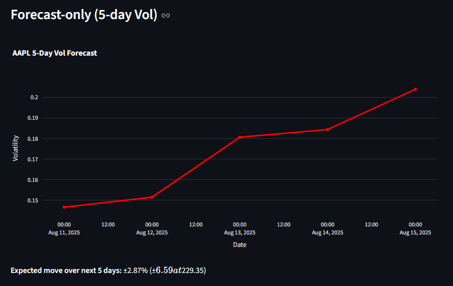

Volatility Forecasting Dashboard
================================

A practical tool for investors to **visualize historical volatility**, **forecast future volatility** over custom horizons, and **understand drivers** like **news sentiment** and **technical momentum**—all in one place.

🌟Why this exists
-----------------

*   **Investor-first utility:** Most vol tools show raw stats; this app turns them into **actionable views** (forecast curve, expected move).
    
*   **Independent signal:** Compare **model-forecasted vol** vs **market IV** to spot potential gaps/mispricings.
    
*   **Explainability:** Surface context (e.g., **news sentiment** **trends, technical momentum**) so users can understand **why** volatility is high or low.
    

🧩What it does
--------------

*   Forecasts **N-day forward volatility** (e.g., 5, 10, 20, 30 days) using multiple models.
    
*   Shows a **split chart**: history (realized vol) vs **forward forecast** (dashed) starting “today.”
    
*   Computes **Expected Move**: ±% and ±$ over the chosen horizon.
    
*   Plots **News Sentiment (7-day MA) vs Historical Vol** with thresholds and concise guidance.
    
*   Adds **conditioned historical insight**: “Given today’s sentiment level, historically the next N-day vol fell between X–Y (median Z).”
    
*   Integrates **RSI/MACD** (from prices) and **volume features** (spikes, z-scores).
    

🏗️Models
---------

*   **GARCH(1,1):** classical conditional volatility model (daily variance → annualized √252).
    
*   **RF-MO (Random Forest, multi-output):** predicts a vector of N future vol values jointly.
    
*   **XGB-MO (XGBoost, multi-output):** gradient boosting, multi-horizon output.
    
*   **NN-MO (small feed-forward, multi-output):** learns the joint shape of the forecast curve.
    

🔣Features (inputs)
-------------------

*   **Price-based:** lagged returns, rolling vol (5/21/63), realized vol (target).
    
*   **Volume:** raw volume, rolling averages, volume spike (current vs 20-day mean), z-score of volume.
    
*   **Technical momentum:** **RSI(14)**, **MACD(12-26-9)** and **signal** (computed locally).
    
*   **News sentiment:** Polygon.io news → daily mean sentiment (−1..+1), **7-day MA**, lags (1, 3), rolling mean & count.
    
*   **VIX**: market-wide fear proxy.
    
*   **Macro (optional):** **FRED** series like **UNRATE** (unemployment) and **FEDFUNDS** (policy rate), business-day ffilled.


🎛️Sidebar controls & what they mean
------------------------------------

Use the left panel to shape the forecast and the charts. Below is what each input does and how it affects results.

### Shared controls (all models)

*   **Model**Choose the forecasting engine:
    
    *   **GARCH** – classic volatility model; fast, good for short horizons and mean-reversion patterns.
        
    *   **RF-MO** – Random-Forest, multi-output (predicts all future days at once). Stable, interpretable via feature importance.
        
    *   **XGB-MO** – Gradient-boosted trees, multi-output. Strong on nonlinearities; more sensitive to hyperparameters.
        
    *   **NN-MO** – Small neural net, multi-output. Can learn smoother forward curves; needs enough data.
        
*   **Forecast horizon (days)**How far ahead to predict (e.g., 5, 10, 20).
    
    *   Longer horizons = more uncertainty and typically smoother forecasts.
        
    *   Multi-output models learn the _shape_ over the whole horizon; GARCH extrapolates the conditional variance.
        
*   **History window for chart (days)**Only affects the **visible** lookback on the “History vs. Forecast” chart.
    
    *   Increase to see more context; decrease to focus on the recent regime.
        
    *   Does **not** change the model’s training data (that uses the full range you selected in the date pickers).
        

### Model-specific controls

#### RF-MO and XGB-MO

*   **n\_estimators**Number of trees.
    
    *   Higher = lower variance / better fit, but slower.
        
    *   Too high with deep trees can overfit (watch validation error).
        
*   **max\_depth**Maximum depth of each tree.
    
    *   Higher depth captures complex interactions, but overfits faster.
        
    *   Start around 4–7; increase only if validation error drops.
        
*   **learning\_rate** Shrinks each boosting step.
    
    *   Lower values (e.g., 0.05–0.15) are safer and smoother; increase for speed at the risk of noise.
        
*   **subsample** Fraction of rows sampled per boosting round.
    
    *   < 1.0 adds randomness → better generalization. Try 0.7–0.9.
        
*   **colsample\_bytree** Fraction of features sampled per tree.
    
    *   < 1.0 reduces correlation between trees. Try 0.6–0.9.
        
*   **reg\_alpha / reg\_lambda** L1/L2 regularization on weights.
    
    *   Increase if you see overfitting or unstable forecasts.
        
    *   Typical: reg\_alpha 0–0.1, reg\_lambda 0.5–2.0.
        

**How these affect the forecast**

*   More trees / depth → tighter in-sample fit; may produce more jagged forward curves if overfit.
    
*   Stronger regularization, subsampling, and lower learning rate → smoother, more conservative forecasts.
    

#### NN-MO

*   **Epochs**How many passes over the training data.
    
    *   More epochs usually reduce training error; stop if validation error/vol curve stops improving.
        
*   **Batch size**Samples per gradient step.
    
    *   Smaller batches can generalize better but train slower; 32–128 is a good range.
        

**How these affect the forecast**

*   More epochs → smoother convergence but risk of overfitting.
    
*   Batch size tweaks stability; if you see noisy forecasts, try a larger batch.
    

### Quick tips

*   **Short horizon (≤ 10 days):** GARCH or RF-MO are good baselines.
    
*   **Medium horizon (10–20 days):** XGB-MO or NN-MO often capture curvature better.
    
*   **If the forecast looks too flat:**
    
    *   Lower reg\_lambda/reg\_alpha, increase n\_estimators, or allow a bit more max\_depth (trees).
        
    *   Increase **epochs** slightly (NN-MO).
        
*   **If the forecast looks too jumpy:**
    
    *   Reduce max\_depth, increase regularization, or lower learning\_rate (XGB-MO).
        
    *   Reduce epochs or add dropout (if enabled) for NN-MO.
        
*   **Charts feel “squished”:** adjust **History window** to focus on the current regime.
    

### What’s actually being forecast?

*   All models output **annualized volatility (σ)** for each day in your chosen horizon.
    
*   The app converts that into an **Expected Move** over the horizon to make it tradable:
  
In this case, the IV is instead our forecasted vol.
    

### Guardrails

*   Hyperparameters don’t change the **data you feed** the model—only how flexibly it fits that data.
    
*   Always sanity-check: if σ is implausibly tiny or huge compared to recent realized vol, dial back complexity or add regularization.
    

📦Data sources
--------------

*   **Prices & VIX:** yfinance
    
*   **News (with sentiment):** **Polygon.io** (Stocks API)
    
*   **Macro:** **FRED** via pandas\_datareader & fredapi
    

🚀Quickstart
------------

*   Python: 3.10 or 3.11 recommended
    
*   Main file path: streamlit\_app/app.py
    
```python
# 1) Clone
git clone https://github.com/<you>/<repo>.git
cd

# 2) Create & activate venv
python -m venv .venv
# Windows
.venv\Scripts\activate
# macOS/Linux
source .venv/bin/activate

# 3) Install deps
pip install -r requirements.txt

# 4) Add local secrets for Streamlit
mkdir -p .streamlit
```

Create .streamlit/secrets.toml:
```
POLYGON_API_KEY = "your_polygon_key"
FRED_API_KEY    = "your_fred_key"
```
Run the app:
```
streamlit run streamlit_app/app.py
```

☁️Deploy on Streamlit Community Cloud
-------------------------------------

*   Repository: connect your GitHub repo
    
*   Main file path: streamlit\_app/app.py
    
*   Python version: 3.10 (or 3.11)
    
*   Secrets (Settings → Secrets):
    
```
POLYGON_API_KEY = "your_polygon_key"
FRED_API_KEY    = "your_fred_key"
```

🧭How it works (high level)
---------------------------

1.  Build a daily **feature matrix** from the inputs (aligned, lagged, rolling).
    
2.  Train either:
    
    *   **GARCH** on returns → forward conditional variance; convert to annualized vol.
        
    *   **MO models** to output an N-step vol path in a single shot (reduces error drift).
        
3.  **Expected Move**: EM ≈ forecast\_vol \* sqrt(horizon/252) \* spot\_price.
    
4.  **Conditioned outcomes:** bucket today’s **NewsSent(7dMA)** and look up the historical distribution of **next N-day realized vol** for that bucket (median, IQR).
    

🧩App views
-----------

*   **Vol: History vs Forecast** (vertical “Today” line; dashed forward curve)
    
*   **Forecast-Only** panel (clean look at the next N days)
    
*   **Expected Move** (±% and ±$)
    
*   **News Sentiment vs Historical Vol** (dual-axis with thresholds + short guidance)
    
*   **Forward-looking caption** using conditioned historical outcomes
    

🔧Troubleshooting
-----------------

*   Path error: ensure streamlit\_app/app.py exists and is selected as the main file.
    
*   Empty/limited news: Polygon free plans restrict lookback; use recent dates.
    
*   Secrets not found: configure .streamlit/secrets.toml locally or Settings → Secrets in the cloud.
    
*   IV quirks: yfinance option\_chain is a simplified IV proxy; production should use a robust IV surface.
    

⚠️Limitations (current)
-----------------------

*   No model confidence bands yet (except the empirical sentiment-conditioned band).
    
*   IV is approximate; horizon-matched IV (per expiry) would be better.
    
*   Sentiment is a daily mean; article clustering and coverage vary by ticker/plan.
    
*   Regime shifts (e.g., 2020 vs 2023) require periodic retraining/regime detection.
    
*   Not a trading system: no costs/slippage/PnL backtests by default.
    
*   IV is derived from option prices, so having Bid-Ask spreads and liquidity metrics as features can result in more accurate forecasting.
    

🗺️Roadmap
----------

*   **Horizon-matched IV** comparison (by expiry tenor).
    
*   **Forecast uncertainty bands** (quantile models / conformal prediction).
    
*   **Strategy backtests** (e.g., straddles when ForecastVol − IV > threshold).
    
*   Explainability: **SHAP** on RF-MO/XGB-MO to show feature drivers today.
    
*   **Econ event features** (earnings, CPI/NFP surprises, FOMC windows).
    
*   **Regime detection** (HMM / Markov switching).
    
*   Model registry and **drift monitoring**.
    

🔐Security
----------

*   Secrets are read from Streamlit secrets; never commit keys to Git.
    
*   Respect each provider’s rate limits and terms.
    

📜Disclaimer
------------

*   **Disclaimer:** This project is for research and education only and is not investment advice. Markets involve risk. Do your own due diligence.
    

📷Screenshots
-------------

### 1. Sidebar Controls


---

### 2. Historical & Forecasted Volatility
Visual comparison of past volatility and the model's predictions.


---

### 3. Forecast vs Expected Move
Forecast only graph with expected move numbers.


---

### 4. News Sentiment vs Historical Volatility
Track how sentiment data correlates with volatility trends.


---

### 5. Empirical Outcomes
Helps to understand what to make of volatility from news sentiment

